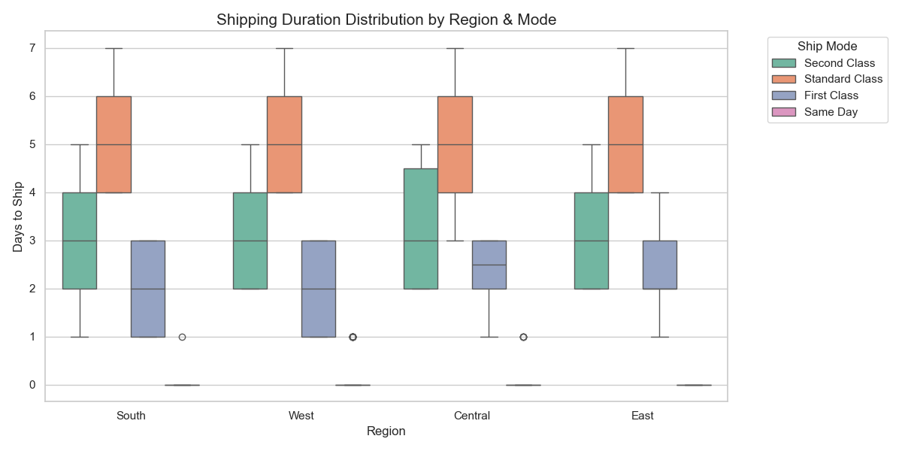
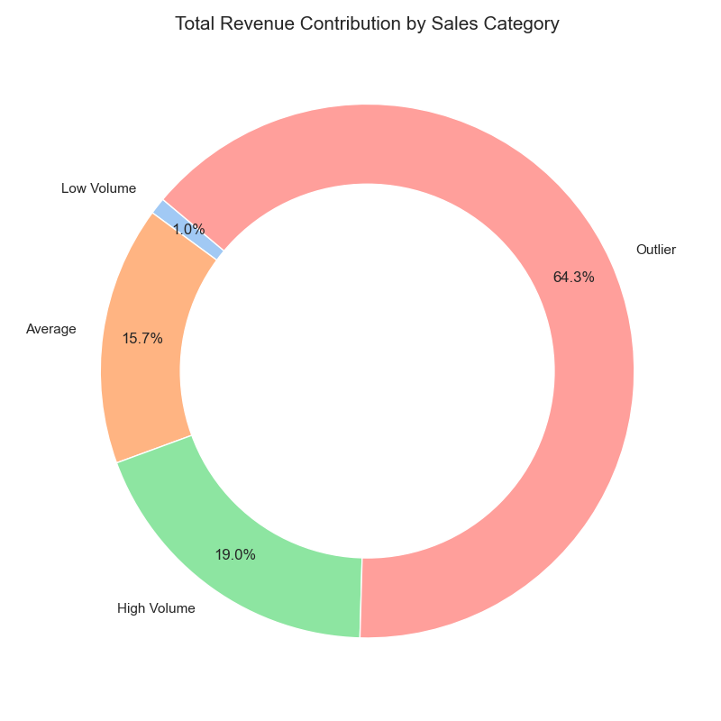
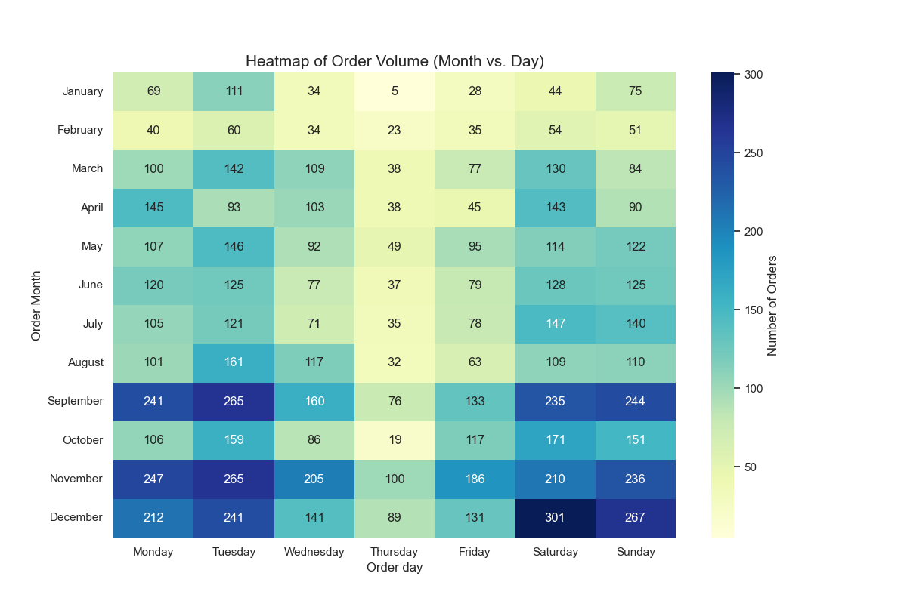
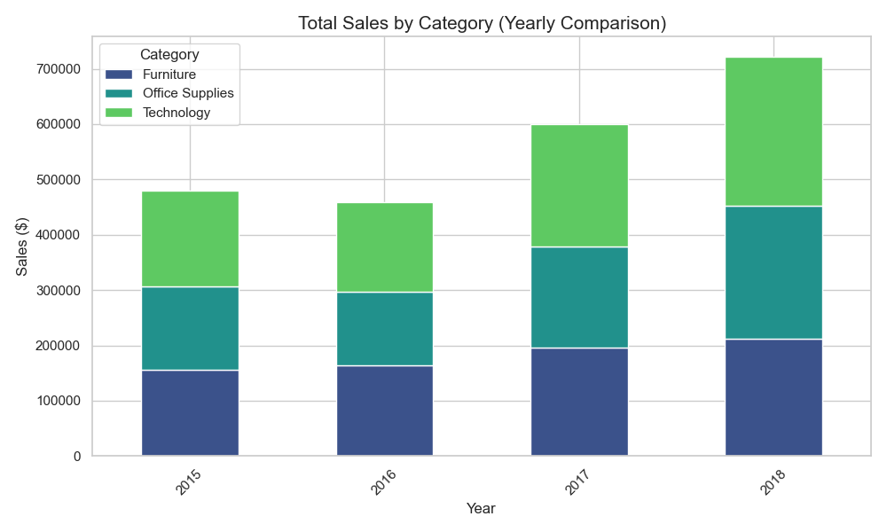

# Superstore Sales Data Analysis Project

## Executive Summary
This project analyzed the **Superstore Sales Dataset** (9,800 records, 18 variables) to extract actionable insights for improving operational efficiency and retail decision-making. 

### Methodology
Data cleaning and transformation were performed in a **Python** environment using the **pandas** library. Key steps included:
* **Date Conversion:** Standardizing timestamps for time-series analysis.
* **Categorization:** Using the **Interquartile Range (IQR)** method to classify sales values and identify outliers.

### Key Insights
* **Shipping Performance:** Standard Class typically took 4–6 days, while First Class was the fastest (1–3 days). Minor delays were noted in the Central and East regions.
* **Revenue Dependence:** The business is heavily reliant on a small number of large transactions; **Outlier Orders** account for **64.3%** of total revenue.
* **Demand Patterns:** Peak volumes occur from **September through December**, with highest activity on Saturdays, Sundays, Tuesdays, and Mondays.
* **Yearly Sales:** While overall sales trended upward, 2016 saw a decline driven by lower performance in **Office Supplies** and **Technology**.

---

## Business Objectives
The primary goal is to streamline superstore activities and support sales management by answering:
1.  How do **Ship Modes** vary across different regions?
2.  Which **Product Category** generates the most revenue?
3.  What are the peak **months and days** for order volumes?
4.  How do **annual sales** compare across categories and years?

---

## Key Findings & Visualizations

### 1. Shipping Duration by Region and Ship Mode (Boxplot)
Python Code:
```
import seaborn as sns
import matplotlib.pyplot as plt

# Setting a clean style for the report
sns.set_theme(style="whitegrid")

plt.figure(figsize=(12, 6))
sns.boxplot(data=df, x='Region', y='Ship Duration', hue='Ship Mode', palette='Set2')

plt.title('Shipping Duration Distribution by Region & Mode', fontsize=15)
plt.xlabel('Region', fontsize=12)
plt.ylabel('Days to Ship', fontsize=12)
plt.legend(title='Ship Mode', bbox_to_anchor=(1.05, 1), loc='upper left')
plt.tight_layout()
plt.savefig(r'Shipping_Duration_Distribution.png')
plt.show()
```


* **Standard Class:** 4 to 6 days.
* **First Class:** 1 to 3 days.
* **Regional Variance:** Central and East regions experienced slightly longer durations, suggesting potential logistical bottlenecks.

### 2. Revenue Contribution by Order Value (Donut Chart)

Python Code:
```
# Aggregate sales by your bins
bin_sales = df.groupby('Order Value Category')['Sales'].sum()

plt.figure(figsize=(8, 8))
plt.pie(bin_sales, labels=bin_sales.index, autopct='%1.1f%%', 
        startangle=140, colors=sns.color_palette('pastel'), pctdistance=0.85)

# Drawing a circle in the middle to make it a donut chart
centre_circle = plt.Circle((0,0), 0.70, fc='white')
fig = plt.gcf()
fig.gca().add_artist(centre_circle)

plt.title('Total Revenue Contribution by Sales Category', fontsize=15)
plt.tight_layout()
plt.savefig(r'Total_Revenue_Contribution_by_Sales_Category.png')
plt.show()
```

* **Outlier Orders:** 64.3% of total revenue.
* **High Volume:** 19%.
* **Average Orders:** 15.7%.
* **Low Volume:** 1%.
> **Takeaway:** The revenue model relies significantly on high-value, large-scale transactions.

### 3. Order Volume Trends (Heatmap)
Python Code:
```
# 1. Create the pivot table (Count of Order IDs)
heatmap_data = df.pivot_table(index='Order Month', 
                             columns='Order day', 
                             values='Order ID', 
                             aggfunc='count')

# 2. Sort months and days correctly
months_order = ['January', 'February', 'March', 'April', 'May', 'June', 
                'July', 'August', 'September', 'October', 'November', 'December']
days_order = ['Monday', 'Tuesday', 'Wednesday', 'Thursday', 'Friday', 'Saturday', 'Sunday']

heatmap_data = heatmap_data.reindex(index=months_order, columns=days_order)

# 3. Plot
plt.figure(figsize=(12, 8))
sns.heatmap(heatmap_data, annot=True, fmt='g', cmap='YlGnBu', cbar_kws={'label': 'Number of Orders'})
plt.title('Heatmap of Order Volume (Month vs. Day)', fontsize=15)
plt.savefig(r'Heatmap_of_Order_Volume.png')
plt.show()
```

* **Peak Months:** September, October, November, and December (seasonal demand).
* **Peak Days:** Saturday, Sunday, Tuesday, and Monday.
* **Low Point:** Thursdays in January show the lowest activity.

### 4. Yearly Sales Comparison (Stacked Bar Chart)
Python Code:
```
# Aggregate Sales by Year and Category
yearly_cat_sales = df.groupby(['Order Year', 'Category'])['Sales'].sum().unstack()

yearly_cat_sales.plot(kind='bar', stacked=True, figsize=(10, 6), color=sns.color_palette('viridis', 3))

plt.title('Total Sales by Category (Yearly Comparison)', fontsize=15)
plt.xlabel('Year', fontsize=12)
plt.ylabel('Sales ($)', fontsize=12)
plt.xticks(rotation=45)
plt.legend(title='Category')
plt.tight_layout()
plt.savefig(r'Total_Sales_by_Category.png')
plt.show()
```

* **Growth:** Consistent growth observed from 2015–2018.
* **2016 Dip:** The only year showing a decline, specifically within the **Office Supplies** and **Technology** sectors.

---

> ## Recommendations
> * **Logistics Optimization:** Review distribution routes in the **Central and East regions** to reduce delivery times.
> * **High-Value Retention:** Implement loyalty programs or personalized service for customers placing "Outlier" or "High Volume" orders.
> * **Inventory Management:** Scale up stock levels from **September to December** to meet seasonal surges.
> * **Targeted Promotions:** Launch marketing campaigns during low-activity periods (e.g., January) to stimulate demand.
> * **Category Monitoring:** Closely track Technology and Office Supplies to respond quickly to any future sales dips with pricing adjustments.

---

## Limitations
* **Scope:** Analysis is limited to the provided 2015–2018 dataset.
* **Methodology:** Findings rely on IQR-based categorization for order groups.
* **External Factors:** The report does not account for market competition, customer satisfaction scores, or external economic variables.
